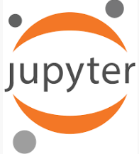

<!-- Typing Animation Header -->

  

  
  
  

---

### 🧠 About Me  

I'm passionate about leveraging <strong>Artificial Intelligence</strong> and <strong>Data Science</strong> to build impactful solutions. With a solid academic foundation and hands-on project experience, I specialize in creating predictive models, analyzing datasets, and developing innovative systems to solve real-world problems.

---

### 🛠️ Skills & Tech Stack

  <!-- Programming Languages -->
  
  
  
  
  

  <!-- ML & Data -->
  
  
  
  

  <!-- IDEs & Tools -->
  

  <!-- Generative AI & Media Tools -->
  
  
  
  
  
  

---

### 🚀 Projects Showcase  

- 🧏‍♂️ **Indian Sign Language Interpreter**  
  &#x1F449; Real-time sign language to text translation using CNN, with **96% accuracy**.

- 🌿 **Automated Plant Species Detection**  
  &#x1F449; CNN-powered model achieving **92% accuracy** for agricultural species recognition.

- 🍃 **LeafID: ML-Based Leaf Identification**  
  &#x1F449; Real-time classification of hibiscus and guava leaves with webcam integration and PDF reporting (**98–99% confidence**).

---

### 📝 Publications & IP  

- 📘 Published papers in **IEEE** and **IJSREM** on:
  - Sign Language Interpretation using AI
  - Plant Species Detection via Machine Learning

- 🧾 Copyright Holder:
  - `RFID-based Product Journey Visualization`
  - `Indian Sign Language Interpreter System`
  - `AQUANOSE: AI Enhanced Aroma Sensing for Sobriety and Safety`

---

### 🧠 AI in Action

---

### 🌐 Let’s Connect  

  
  
  
  

